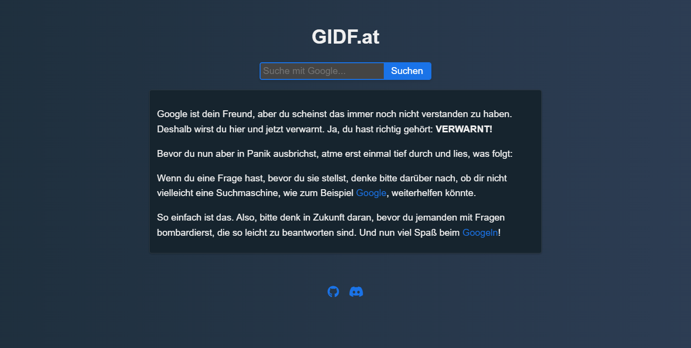

# Stylish GIDF.at

An enhanced and user-friendly version of GIDF.at, an informational page that encourages users to effectively use search engines like Google. This redesigned page features an integrated search box, a dark mode toggle, and social media links, offering a responsive design for all devices.

## Features

- Integrated search box for Google
- Dark mode toggle
- Social media links (GitHub and Discord)
- Responsive design

## Installation

1. Clone the repository:
git clone https://github.com/Mischmaschine/gidf.git

2. Open the `index.html` file in your preferred web browser.

## Contributing

1. Fork the repository.
2. Create a new branch for your changes: `git checkout -b new-feature`
3. Commit your changes: `git commit -m "Add new feature"`
4. Push your branch: `git push origin new-feature`
5. Create a pull request.

## License

This project is licensed under the MIT License. See the [LICENSE](./LICENSE) file for details.
